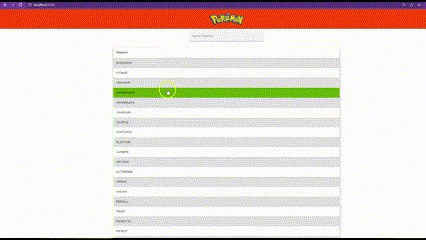

# Website

Ediannys Gonzalez 

<p align="center">
  <kbd>
</img>
  </kbd>
</p>


## Versions💻
```
node@v18.12.1 
npm@8.19.2
Angular CLI 15.0.4
```

## How to use?

```bash
# Clone the repository
git clone https://github.com/Ediannys/website-pokemon.git

# Go to the project folder
cd website-pokemon

# Install the dependencies
npm install

# Start on Local server
ng serve
```

